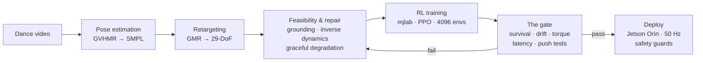

<div align="center">

# G1 Dance Studio

**Reference dance video in → a balance-robust RL controller out, performed live by a Unitree G1 humanoid.**

[](#tech-stack)
[](#tech-stack)
[](#tech-stack)
[](#tech-stack)
[](#tech-stack)
[](#the-robot)
[](#project-status)
[](#license)

English · [Tiếng Việt](README.vi.md)


*Left: the intended choreography. Right: the trained policy — a real neural network
balancing 29 joints at 50 Hz in physics simulation, rendered on the same robot model
it was trained on.*

</div>

---

## What this is

A full video-to-robot pipeline and operator console. You give it a phone video of a
dancer; it extracts the 3D motion, retargets it to the G1's 29 degrees of freedom,
repairs anything the hardware physically cannot do, trains a reinforcement-learning
controller in GPU simulation, gates it through an automated acceptance exam, and
deploys it to the real robot with a safety-first, human-in-the-loop runtime.

The end goal is a **plug-and-play show product**: an operator powers on the robot,
picks a dance from the library, and deploys — reliably, venue after venue.



### Same-scene comparison

The operator console renders the intended dance and the actual policy **in one
scene, color-coded** — divergence is visible at a glance:

<div align="center">

</div>

## Highlights

- **Physics-honest motion repair.** Inverse-dynamics feasibility analysis detects
  choreography the hardware cannot execute (e.g. 173 Nm demanded of a 40 Nm ankle)
  and degrades gracefully: global tempo scaling first, then track-to-limit clamping,
  then substitution for missing degrees of freedom — never commanding a motion that
  saturates a motor.
- **Teacher–student RL with deployable observations.** The critic trains on
  privileged simulator state; the deployed actor sees only signals the real robot
  can measure, plus a 5-frame observation history to infer velocity — no fragile
  state estimator in the loop.
- **A calibrated acceptance gate.** Policies are examined across latency (0–80 ms),
  shoves, and sensor noise on 128 parallel rollouts before hardware is ever
  considered; per-beat fall clustering and ankle-torque percentiles localize
  failures to choreography timestamps.
- **Operator console, not a dashboard.** Show mode with setlists and venues,
  drag-and-drop pipeline with per-stage logs, live training/cost telemetry,
  side-by-side/overlay/landmark previews, signed verification verdicts, policy
  rollback, and an audit timeline.
- **Safety as architecture.** Damp-on-any-exit, an independent damping watchdog,
  action clamps and rate limits, estimator-validity checks, contact-before-entry
  gating, typed deploy confirmation — designed for a robot that has **no hardware
  e-stop**.

## Tech stack

| Layer | Technology | Role |
|---|---|---|
| Perception | **GVHMR**, SMPL / SMPL-X | Monocular video → 3D human motion |
| Retargeting | **GMR** | Human skeleton → 29-DoF G1 joint space |
| Motion QA | NumPy · SciPy · MuJoCo `mj_inverse` | De-jitter, grounding, dynamic feasibility, repair |
| Training | **mjlab 1.5.0** · rsl_rl (PPO) · MuJoCo 3.10 + Warp | 4096-env GPU RL, domain randomization |
| Verification | Custom gate · held-out evals · faithful-model sandbox | Survival / drift / torque / latency exams |
| Policy format | **ONNX** (normalization baked in) | Portable, deploy-identical inference |
| Deploy runtime | unitree_sdk2 (`unitree_hg`) · CycloneDDS · onnxruntime | 50 Hz PD control loop on Jetson Orin |
| Backend | **FastAPI** | Local engine + REST API (`:8735`) |
| Frontend | **React 19** · Vite 7 · Tailwind · shadcn/ui | Operator console |
| Desktop | pywebview (Qt / PySide6) | Native window, no browser dependency |
| Cloud | GreenNode (RTX 4090) · Weights & Biases | Training compute + experiment tracking |

Exact training-environment pins live in
[`cloud/env_lock/requirements.lock.txt`](cloud/env_lock/requirements.lock.txt) —
versions are load-bearing (see the [field guide](docs/FIELD_GUIDE.txt) war stories).

## Repository layout

```
├── pipeline/        # Core pipeline: retarget, grounding, feasibility, deploy runtime, guards
├── cloud/           # Training recipes (v2→v8), curriculum launchers, gate, env lock
├── tools/           # Sim studio (side-by-side/overlay), motion repair, feasibility, triage
├── ui/              # FastAPI backend + React operator console + desktop shell
├── deploy/          # Robot-day scripts and deploy kit
├── experiments/     # Registry, audits, design memos — every claim with raw output
├── docs/            # Field guide, project state (source of truth), safety docs
├── tests/           # Unit + integration tests (pytest)
├── scripts/         # Launchers, watchers, pull/push helpers
└── data/            # Dances, policies, motions, previews, telemetry (mostly gitignored)
```

## Getting started

**Prerequisites:** Ubuntu 22.04, Miniconda, the `g1dance` conda environment, and
(for training) a CUDA GPU or a GreenNode account. Body models (SMPL/SMPL-X) require
registration and are not distributed with this repo.

```bash
# Operator console (desktop app)
./scripts/launch-studio.sh          # or double-click "G1 Dance Studio"

# Headless server (e.g. to tunnel from another machine)
python ui/server.py                 # console at http://localhost:8735

# Test suite
./scripts/run_tests

# Train the current recipe on a provisioned GPU box (preflights before any GPU spend)
ssh <box> 'cd $NB && setsid nohup bash cloud/run_attempt5.sh > attempt5.out 2>&1 &'
```

New to the codebase? Read **[`docs/FIELD_GUIDE.txt`](docs/FIELD_GUIDE.txt)** — a
plain-language, top-to-bottom explanation of every stage, term, and past mistake.
Current state and decision log: **[`docs/PROJECT_STATE.md`](docs/PROJECT_STATE.md)**.

## The robot

Unitree **G1 EDU Ultimate** — 29 controllable DoF plus Inspire FTP dexterous hands,
~48 V (13S) battery, onboard Jetson Orin. Joint torque limits range 5–139 Nm; the
ankles (~40 Nm usable, speed-derated) are the binding constraint for dynamic
choreography and drive most of the engineering in `pipeline/motion_dynamics.py`.

> ⚠️ **This robot has no torque-cutting hardware e-stop.** The only hard stops are
> the remote's B-damp and the power switch. Every deploy requires a sim-verified
> policy, a typed confirmation, and a human physically present with the damping
> remote. See [`docs/DEPLOY_SAFETY_GUARDS.md`](docs/DEPLOY_SAFETY_GUARDS.md).

## Project status

| Track | State |
|---|---|
| Video → motion extraction | ✅ Working end to end |
| Motion feasibility & repair | ✅ Inverse-dynamics gate + graceful degradation |
| Operator console | ✅ Show mode, previews, audit, rollback |
| RL controller | 🔄 v8 training (teacher–student obs, hip-strategy shaping, 1.8× feasible motion) |
| Gate calibration vs. real-robot data | 🔄 In progress |
| Hardware | 🛠 Down for repair (DC-DC converter RMA); deploy work staged |

Full history with evidence: [`docs/PROJECT_STATE.md`](docs/PROJECT_STATE.md) and
[`experiments/REGISTRY.md`](experiments/REGISTRY.md).

## Documentation

| Document | What it covers |
|---|---|
| [Field guide](docs/FIELD_GUIDE.txt) | Plain-language onboarding: every concept, stage, and term |
| [Project state](docs/PROJECT_STATE.md) | Live decision log — the single source of truth |
| [Deploy safety guards](docs/DEPLOY_SAFETY_GUARDS.md) | The five deploy-side guards and their gantry validation plan |
| [Experiment registry](experiments/REGISTRY.md) | Every policy/run with motion SHA, gate output, calibrated estimate |
| [Architecture](docs/architecture.md) | Pinned component choices and rationale |
| [Contributing](CONTRIBUTING.md) | Dev setup, conventions, measurement discipline |

## Contributing

Internal project — see [CONTRIBUTING.md](CONTRIBUTING.md) for conventions (notably:
**measurement discipline** — no decisive claim without an independent cross-check,
and every measurement script commits alongside its raw output). Bug reports and
feature requests use the [issue templates](.github/ISSUE_TEMPLATE/).

## Acknowledgements

Built on the shoulders of [BeyondMimic](https://github.com/HybridRobotics/whole_body_tracking),
[mjlab](https://github.com/mujocolab/mjlab), [MuJoCo](https://mujoco.org),
[GVHMR](https://github.com/zju3dv/GVHMR), [GMR](https://github.com/YanjieZe/GMR),
and Unitree's [first-party RL stacks](https://github.com/unitreerobotics).

## License

Proprietary — all rights reserved. Third-party components retain their own licenses.
