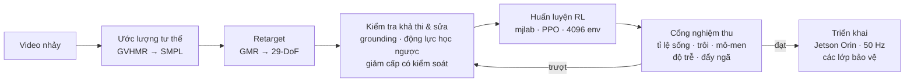

<div align="center">

# G1 Dance Studio

**Đưa vào một video nhảy mẫu → nhận về bộ điều khiển RL giữ thăng bằng, biểu diễn trực tiếp trên robot hình người Unitree G1.**

[](#công-nghệ)
[](#công-nghệ)
[](#công-nghệ)
[](#công-nghệ)
[](#công-nghệ)
[](#robot)
[](#tình-trạng-dự-án)

[English](README.md) · Tiếng Việt


*Trái: vũ đạo mong muốn. Phải: policy đã huấn luyện — một mạng nơ-ron thật đang giữ
thăng bằng 29 khớp ở tần số 50 Hz trong mô phỏng vật lý, dựng trên đúng mô hình robot
đã dùng để huấn luyện.*

</div>

---

## Đây là gì

Một pipeline hoàn chỉnh từ video đến robot, kèm bảng điều khiển cho người vận hành.
Bạn đưa vào một video quay người nhảy; hệ thống trích xuất chuyển động 3D, ánh xạ
sang 29 bậc tự do của G1, sửa những đoạn phần cứng không thể thực hiện, huấn luyện
bộ điều khiển học tăng cường (RL) trong mô phỏng GPU, kiểm định qua "cổng" nghiệm thu
tự động, rồi triển khai lên robot thật với runtime an toàn có con người giám sát.

Mục tiêu cuối: một **sản phẩm biểu diễn cắm-là-chạy** — người vận hành bật robot,
chọn bài nhảy trong thư viện, và triển khai — ổn định, hết địa điểm này đến địa điểm khác.



### So sánh cùng khung cảnh

Bảng điều khiển dựng vũ đạo mong muốn và policy thực tế **trong cùng một khung cảnh,
phân biệt bằng màu** — nhìn là thấy ngay chỗ lệch:

<div align="center">

</div>

## Điểm nổi bật

- **Sửa chuyển động trung thực với vật lý.** Phân tích động lực học ngược phát hiện
  vũ đạo mà phần cứng không thể thực hiện (ví dụ: đòi 173 Nm ở cổ chân chỉ có 40 Nm)
  và giảm cấp có kiểm soát: chậm toàn cục trước, rồi bám-đến-giới-hạn, rồi thay thế
  cho các bậc tự do robot không có — không bao giờ ra lệnh vượt bão hòa động cơ.
- **RL thầy–trò với quan sát triển khai được.** Critic huấn luyện trên trạng thái
  đặc quyền của mô phỏng; actor triển khai chỉ thấy tín hiệu robot thật đo được,
  cộng lịch sử 5 khung quan sát để tự suy ra vận tốc — không phụ thuộc bộ ước lượng
  trạng thái dễ vỡ.
- **Cổng nghiệm thu được hiệu chuẩn.** Policy bị "khảo thí" qua độ trễ (0–80 ms),
  lực đẩy và nhiễu cảm biến trên 128 rollout song song trước khi nghĩ đến phần cứng.
- **Bảng điều khiển vận hành, không phải dashboard.** Chế độ biểu diễn với setlist
  và địa điểm, pipeline kéo-thả kèm log từng bước, telemetry huấn luyện/chi phí,
  xem trước song song/chồng lớp/landmark, phán quyết kiểm định có chữ ký, rollback
  policy, dòng thời gian audit.
- **An toàn là kiến trúc.** Damp khi thoát bất kỳ, watchdog damp độc lập, kẹp biên
  và giới hạn tốc độ lệnh, kiểm tra tính hợp lệ của ước lượng, chặn vào khi chưa đủ
  tiếp xúc chân, xác nhận triển khai bằng gõ phím — thiết kế cho một robot **không
  có nút dừng khẩn phần cứng**.

## Công nghệ

| Tầng | Công nghệ | Vai trò |
|---|---|---|
| Thị giác | **GVHMR**, SMPL / SMPL-X | Video đơn mắt → chuyển động người 3D |
| Retarget | **GMR** | Khung xương người → không gian khớp 29-DoF |
| Kiểm định chuyển động | NumPy · SciPy · MuJoCo `mj_inverse` | Khử rung, grounding, khả thi động lực học, sửa |
| Huấn luyện | **mjlab 1.5.0** · rsl_rl (PPO) · MuJoCo 3.10 + Warp | RL 4096 env trên GPU, domain randomization |
| Kiểm chứng | Cổng tự dựng · held-out eval · sandbox mô hình trung thực | Khảo thí sống/trôi/mô-men/độ trễ |
| Định dạng policy | **ONNX** (đã nhúng chuẩn hóa) | Suy luận giống hệt lúc triển khai |
| Runtime triển khai | unitree_sdk2 (`unitree_hg`) · CycloneDDS · onnxruntime | Vòng điều khiển PD 50 Hz trên Jetson Orin |
| Backend | **FastAPI** | Engine cục bộ + REST API (`:8735`) |
| Frontend | **React 19** · Vite 7 · Tailwind · shadcn/ui | Bảng điều khiển vận hành |
| Desktop | pywebview (Qt / PySide6) | Cửa sổ native, không phụ thuộc trình duyệt |
| Cloud | GreenNode (RTX 4090) · Weights & Biases | Máy huấn luyện + theo dõi thí nghiệm |

Phiên bản môi trường huấn luyện được ghim tại
[`cloud/env_lock/requirements.lock.txt`](cloud/env_lock/requirements.lock.txt).

## Bắt đầu

```bash
# Bảng điều khiển (ứng dụng desktop)
./scripts/launch-studio.sh

# Server không giao diện (ví dụ để tunnel từ máy khác)
python ui/server.py                 # http://localhost:8735

# Bộ test
./scripts/run_tests
```

Mới vào dự án? Đọc **[`docs/FIELD_GUIDE.txt`](docs/FIELD_GUIDE.txt)** — giải thích
từ đầu đến cuối bằng ngôn ngữ đơn giản. Trạng thái hiện tại và nhật ký quyết định:
**[`docs/PROJECT_STATE.md`](docs/PROJECT_STATE.md)**.

## Robot

Unitree **G1 EDU Ultimate** — 29 DoF điều khiển được, bàn tay khéo Inspire FTP,
pin ~48 V (13S), Jetson Orin trên thân. Giới hạn mô-men khớp 5–139 Nm; cổ chân
(~40 Nm khả dụng, giảm theo tốc độ) là nút thắt của vũ đạo động.

> ⚠️ **Robot này không có nút dừng khẩn cắt mô-men phần cứng.** Chỉ có nút B-damp
> trên remote và công tắc nguồn. Mọi lần triển khai đều cần policy đã kiểm chứng
> mô phỏng, xác nhận gõ phím, và người thật cầm remote đứng cạnh.
> Xem [`docs/DEPLOY_SAFETY_GUARDS.md`](docs/DEPLOY_SAFETY_GUARDS.md).

## Tình trạng dự án

| Hạng mục | Trạng thái |
|---|---|
| Video → trích xuất chuyển động | ✅ Chạy trọn vẹn |
| Khả thi & sửa chuyển động | ✅ Cổng động lực học ngược + giảm cấp có kiểm soát |
| Bảng điều khiển vận hành | ✅ Show mode, preview, audit, rollback |
| Bộ điều khiển RL | 🔄 Đang huấn luyện v8 (obs thầy–trò, hip-strategy, motion 1.8×) |
| Hiệu chuẩn cổng với dữ liệu robot thật | 🔄 Đang thực hiện |
| Phần cứng | 🛠 Đang sửa (RMA bộ chuyển đổi DC-DC) |

## Giấy phép

Độc quyền — bảo lưu mọi quyền. Các thành phần bên thứ ba giữ giấy phép riêng.
